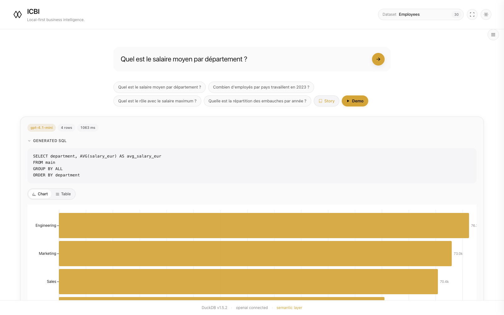
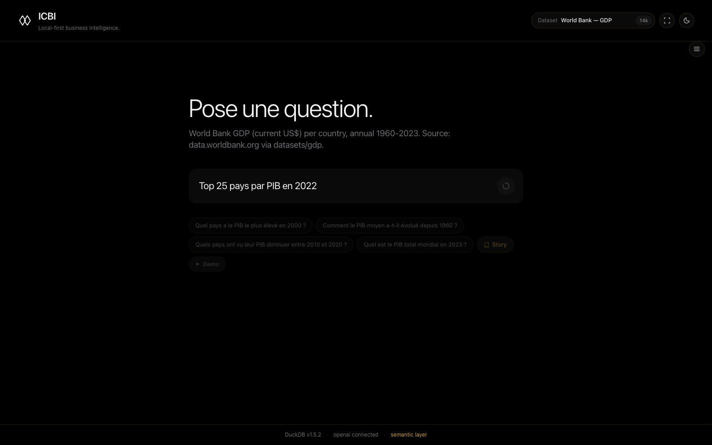
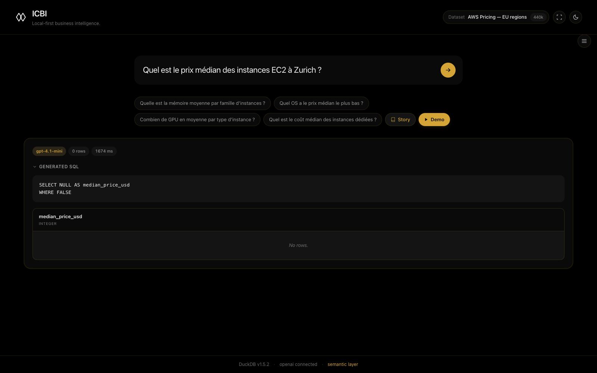
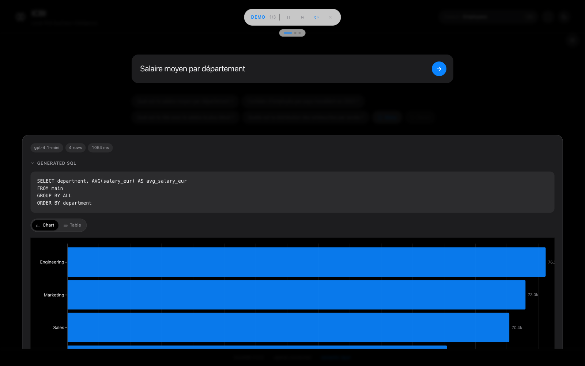
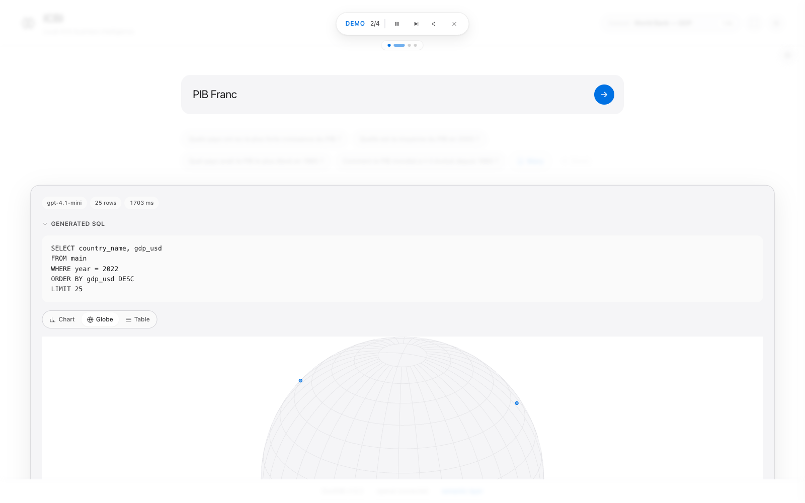
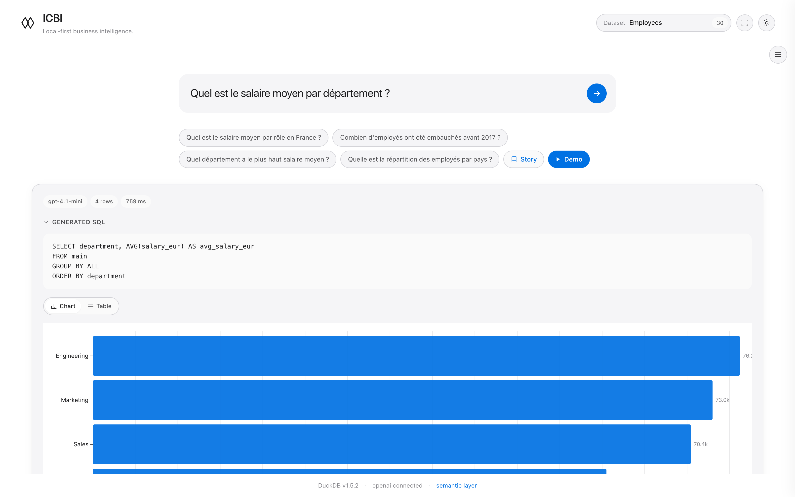

# ICBI — Infinity Cloud Business Intelligence

> BI local-first agnostique. NL → SQL → résultat visuel, sans cloud, sans vendor-lock.



**Stack** : Bun · DuckDB v1.5.2 · OpenAI gpt-4.1-mini · Vue 3 · Observable Plot · TypeScript

**Statut** : Sprint 1 (13/13) + Sprint 2 (16/16) + Sprint 2.6 (2 fix) + Sprint 2.7 (mode démo) + Sprint 2.8 Wave 1 (design Néo-Cyberpunk Épuré) — **32 livrables en 6 jours**, 3 pivots majeurs absorbés.

---

## Ce que fait ICBI

- **Ingère un CSV** (testé jusqu'à 440K lignes × 94 colonnes en 3.7 s).
- **Profile automatique** des colonnes (types DuckDB, cardinalité, distributions, NULL %).
- **Génère le semantic layer YAML** par LLM (descriptions, glossary métier, dimensions/measures).
- **Convertit une question NL en SQL DuckDB** type-aware (DOUBLE → `> 0`, VARCHAR → `!= ''`, BOOLEAN → `= TRUE`, DATE → `BETWEEN`).
- **Affiche la viz adaptée** : bar / line / scatter / heatmap / scorecard / globe orthographic 3D.
- **Mode démo auto-play** : typing effect, sequences scriptées par profil, TTS Web Speech API (Amélie FR-FR), focus blur Apple Keynote.
- **Mode présentation fullscreen** : vrai noir #000, navigation clavier, slides précalculées.
- **Multi-profils** : 4 datasets validés en parallèle (AWS pricing, employés, World Bank GDP, multimodal mini), commutables sans redémarrage.

---

## Galerie

| | |
|--|--|
|  |  |
| **Bar chart Apple+cyberpunk** — jaune signature, fullwidth, restraint | **Globe 3D** — orthographic, vrai noir, dots multi-layer glow |
|  |  |
| **Scorecard 96 px ultralight** — color accent + text-shadow glow | **Mode démo + TTS** — voix Amélie, pill controls Apple Keynote |
|  |  |
| **Démo state machine** — progression Q1→Q2 transitions douces | **Loading state propre** — spinner SF segmented |

📹 [`demo-icbi.mp4`](./media/demo-icbi.mp4) — 28 s, 1280×800, 30 fps (333 KB)

---

## Documents

- [`docs/linkedin-article.md`](./docs/linkedin-article.md) — Article LinkedIn 1100 mots (méthode, patterns, pivots)
- [`docs/synapse-adn-cipher.md`](./docs/synapse-adn-cipher.md) — Le système de mémoire compressée
- [`docs/patterns.md`](./docs/patterns.md) — Patterns techniques découverts en pratique
- [`docs/timeline.md`](./docs/timeline.md) — Chronologie 6 jours, 32 livrables

---

## Architecture (résumé)

```
panda-portal/
├── server.ts                       # Bun.serve nu, routes /api/icbi/* dans bloc encadré
├── src/backend/
│   ├── icbi/
│   │   ├── duckdb.ts               # singleton per-profile, JSON-safe (BigInt → number)
│   │   ├── ingest.ts               # COPY CSV → DuckDB + index auto low-cardinality
│   │   ├── profiler.ts             # SUMMARIZE-based, 244 ms / 94 cols
│   │   ├── views.ts                # vues matérialisées par profil
│   │   ├── profiles/               # CRUD + migration sha256-verified Sprint1→S2
│   │   │   ├── manager.ts
│   │   │   ├── types.ts
│   │   │   └── migrate.ts
│   │   ├── semantic/
│   │   │   ├── seed.yaml           # versionné Git (descriptions + glossary)
│   │   │   ├── auto-generator.ts   # LLM génère seed.yaml depuis profileTable
│   │   │   ├── generator.ts        # merge seed + profiling → runtime YAML
│   │   │   └── loader.ts
│   │   └── llm/
│   │       ├── openai.ts           # askWithFallback gpt-4.1-mini → gpt-4.1
│   │       └── prompt.ts           # system prompt type-aware + few-shots DuckDB
│   └── services/
│       └── icbiAnalyticsService.ts # orchestrateur, errorKind, query timeout 30s
└── src/frontend/src/
    ├── views/IcbiView.vue          # layout dual-mode (is-empty 880px / has-result 1800px)
    └── components/icbi/
        ├── DemoPlayer.vue          # state machine 7 états, typing effect, TTS
        ├── PlotView.vue            # auto-detect chart type (Observable Plot)
        ├── GlobeView.vue           # orthographic projection + multi-layer dot glow
        ├── StoryView.vue           # narration LLM multi-step
        └── country-coords.ts       # 250 pays Natural Earth, ISO3+lat/lng, Maps O(1)
```

**Routes API** : `/api/icbi/{health, tables, profile/:t, query, ask, semantic, history, profiles, profiles/:slug/{activate, suggestions, enrich}, multi-ask, story, vocal-query, demo/sequence, reset}` (15 endpoints).

---

## Performance mesurée (AWS pricing 440K × 94)

| Étape | Latence |
|-------|---------|
| Ingest CSV 272 MB | 3.7 s |
| Profile 94 cols (SUMMARIZE) | 244 ms |
| Création vues vw_ec2 (439 795 rows) | 44 ms |
| Création vue vw_bedrock (92 rows) | 1 ms |
| `/ask` gpt-4.1-mini (~5K prompt tokens) | 1.6–3.1 s |
| `/ask` gpt-4.1 fallback EXPLAIN-validated | 0.6 s |
| Bench mémoire DuckDB sur 4 profils actifs | < 200 MB RSS |

---

## Pivots gérés

1. **Architecture Sprint 1** : standalone (ports 3500/3501) → module intégré au portail Bun. Une heure après briefing initial. Aucun code perdu.
2. **LLM Sprint 1 → Sprint 2** : Gemini → OpenAI suite à révocation clé pour leak. Swap provider en 15 min, gpt-4.1-mini default + gpt-4.1 fallback validé EXPLAIN.
3. **Design Sprint 2 → 2.6 → 2.8** : cyberpunk → Apple × Jony Ive → Néo-Cyberpunk Épuré (mariage des deux). Refonte CSS variables + globe + chart + buttons + scan-line. Validé 7 screenshots Puppeteer dsf=1.

---

## Licence

Cette documentation est publiée à titre de témoignage de pratique. Le code source d'ICBI reste dans le portail privé qui l'héberge.
