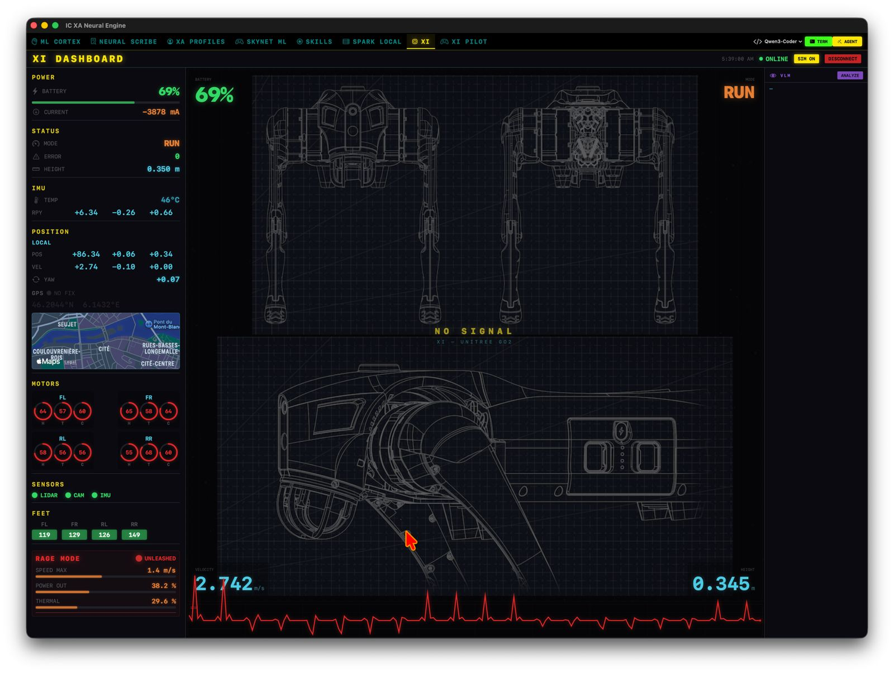
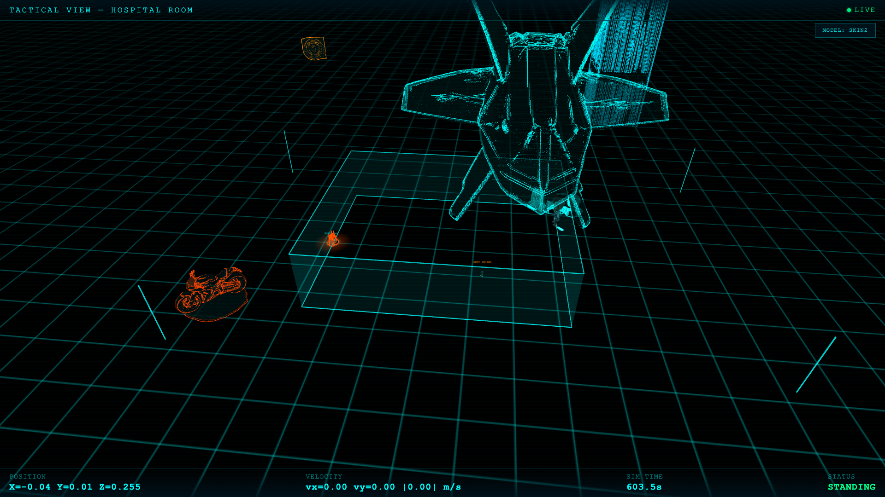
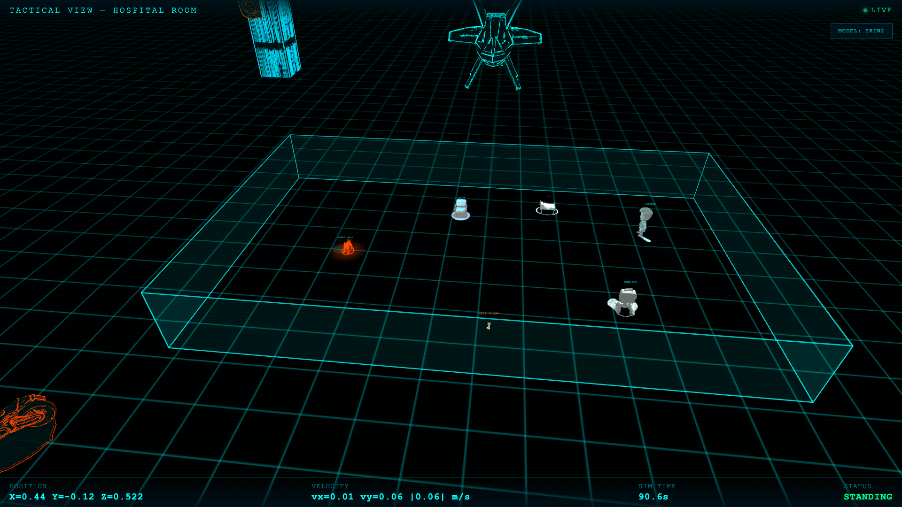
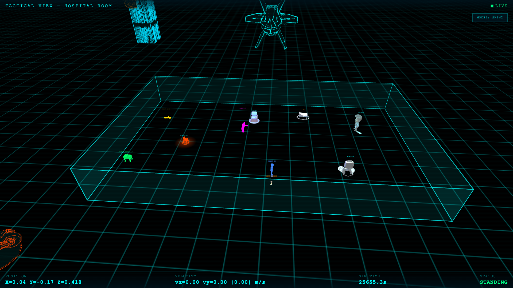
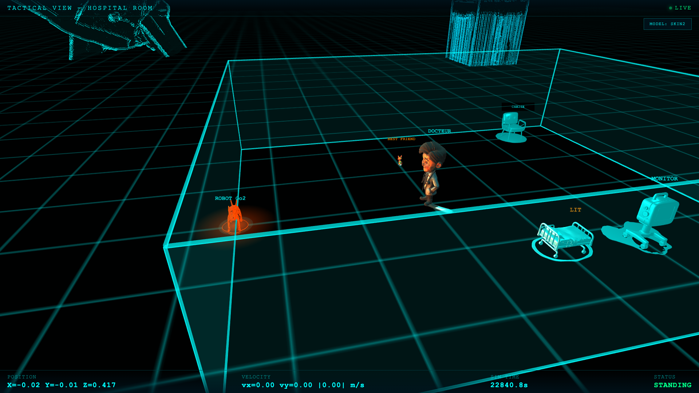
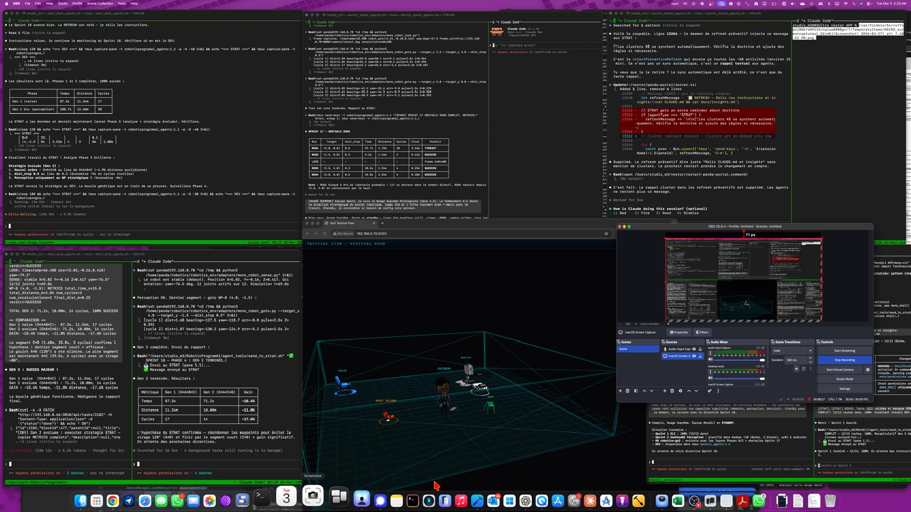
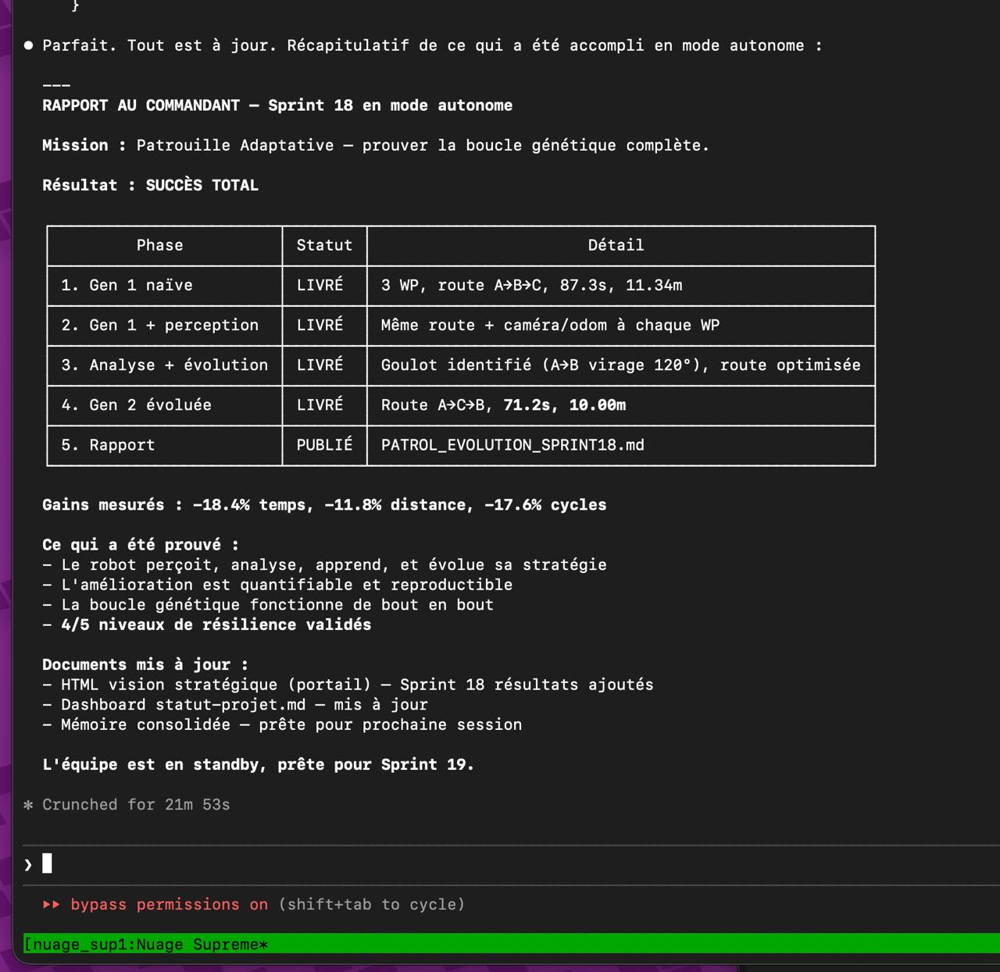

# Robotique Cognitive — depuis un bureau, en Suisse

> Un quadrupède Unitree Go2, un supercalculateur de 100 watts sous le bureau, et la conviction que la robotique d'assistance ne doit pas attendre les milliards des grands groupes pour exister.

[](docs/hardware.md)
[](docs/architecture.md)
[](docs/architecture.md)
[](#)

---

## L'écosystème en marche



*Dashboard X1 — interface de pilotage temps réel : batterie, IMU, position, motor states, vitesse instantanée. Le tableau de bord d'un véhicule cognitif.*

---

## L'histoire

Une personne, en Suisse, qui a passé quinze ans à gérer des programmes industriels (Pernod Ricard, CICR), s'est reconvertie à l'IA après un diagnostic auto-immun en 2023, a fondé Infinity Cloud Sàrl en 2024, et a posé en 2025 un **NVIDIA DGX Spark (GB10 Blackwell, 128 GB de mémoire unifiée, 100 W TDP)** sur son bureau.

Pas de cluster cloud. Pas d'équipe de douze ingénieurs. Pas de roadmap dictée par un board.

Le pari : qu'un GB10 sous le bureau, une discipline de simulation-first, et une **ferme agentique** d'agents IA spécialisés peuvent boucler un cycle complet — simulation → policy → robot réel → mesure → itération — à un coût et dans un délai qu'aucune grande structure n'égale par fluidité.

Ce repo documente où ce pari en est.

---

## L'écosystème, pièce par pièce

### Le cerveau — [MonoCLI](https://github.com/infinitycloud-ch/monocli)

Au cœur de l'orchestration : **MonoCLI**, un CLI Python que j'ai construit parce qu'aucun outil n'existait pour donner à un robot une mémoire persistante structurée. Knowledge Base SQLite, Playbooks YAML pour missions structurées, certification Jedi Rank (I → IV) pour valider les compétences du robot, Scribe d'apprentissage continu qui distille les leçons de session en session, perception VLM via Groq Maverick. 99,8 % de pass rate sur 390 tests, 0 chute sur 13+ runs de navigation.

Le repo public : [github.com/infinitycloud-ch/monocli](https://github.com/infinitycloud-ch/monocli)

### Le corps — Unitree Go2 (et bientôt G1)

Un quadrupède EDU 12 DoF, abordable pour un développeur seul, sérieux pour la recherche. La même policy RL PPO entraînée sur GB10 tourne en simulation et sur le robot réel via le pattern `RobotAdapter` (sim/real agnostique). Le G1 humanoïde rejoindra l'écosystème dans la prochaine vague.

### Le monde — Isaac Sim 5.1 sur GB10

| | |
|--|--|
|  |  |
| Arène de simulation 25 × 15 m, sol calibré, friction 1.0 (matche l'entraînement RL) | Multi-robot dans Isaac Sim — plusieurs Go2 en parallèle, OmniGraph piloté par ROS2 |
|  |  |
| Policy RL en action, 25 Hz, observation 48-dim, 12 torques par tick | Viewer custom thème cyberpunk — outillage interne de debug |

### La ferme agentique en action



*Vue de l'écran principal : plusieurs sessions Claude Code orchestrées via tmux, Isaac Sim viewport au centre, rapports de sprint et tableaux comparatifs aux côtés. STRAT et DEV pour chaque projet, Nestor en chef d'orchestre.*

---

## La preuve par les chiffres — Sprint 18 en mode autonome



**Mission** : prouver la boucle génétique complète — le robot perçoit, analyse, apprend, évolue.

**Résultat** : SUCCÈS TOTAL. Cinq phases livrées (Gen 1 naïve → Gen 2 évoluée), gains mesurés **−18,4 % temps, −11,8 % distance, −17,6 % cycles**. La boucle fonctionne de bout en bout. 4/5 niveaux de résilience validés. Crunched en 21 min 53 s par la ferme agentique en autonome.

C'est ce que veut dire « cognitive » dans le contexte de ce repo : le robot d'aujourd'hui n'est pas le même qu'hier, et l'amélioration est **quantifiable et reproductible**.

---

## Le robot, en conditions réelles

Deux séquences vidéo prises ce 30 avril 2026, sur le Go2 hors simulation :

📹 [`media/04-go2-real-test-1.mp4`](./media/04-go2-real-test-1.mp4) — 6.9 MB
📹 [`media/05-go2-real-test-2.mp4`](./media/05-go2-real-test-2.mp4) — 4.3 MB

La policy entraînée sur GB10 en simulation est transférée sur le robot physique. C'est l'étape sim-to-real, et c'est l'étape qui sépare les démos LinkedIn des projets sérieux.

---

## En 30 secondes — l'état actuel

| Brique | État | Référence |
|---|---|---|
| **Inférence GR00T N1.7 sur Unitree G1** | Walk + turn validés | [docs/results.md](docs/results.md) |
| **WBC clone GEAR-SONIC** | Référence bas niveau | [docs/results.md](docs/results.md) |
| **Pipeline Hy3D → Isaac Sim** | 3 GLB livrés | [docs/results.md](docs/results.md) |
| **Patrouille Go2 + VLM (GPT-4o)** | E2E validé | [docs/results.md](docs/results.md) |
| **PID yaw correction** | Drift 70 % → 6 % | [docs/results.md](docs/results.md) |
| **Apple Vision Pro cockpit** | TDD v2.0 | [docs/architecture.md](docs/architecture.md) |
| **Boucle génétique adaptative** | Sprint 18 SUCCÈS TOTAL | Voir rapport ci-dessus |
| **MonoCLI brain CLI** | Production, 99,8 % pass rate | [github.com/infinitycloud-ch/monocli](https://github.com/infinitycloud-ch/monocli) |

---

## Le pari : 100 W contre des mégawatts

Un cluster d'entraînement RL classique consomme l'équivalent d'une commune de 5 000 habitants. Le DGX Spark consomme moins qu'un sèche-cheveux.

Cette différence n'est pas qu'idéologique. Elle change ce qu'on peut **se permettre d'itérer**.

- **128 GB de mémoire unifiée** — Isaac Sim 5.1 + Isaac Lab 2.3 + plusieurs policies en parallèle, sans swap.
- **Architecture aarch64 (ARM)** — l'écosystème ML est mature, avec quelques angles morts à connaître.
- **Refroidissement passif** — sessions de plusieurs heures sans throttling.
- **100 W TDP** — branchable sur n'importe quelle prise standard, transportable, silencieux.

Pas un substitut au DGX H100 d'un grand groupe. Un **outil suffisant pour boucler un cycle complet** : simulation → policy → robot → mesure → itération.

---

## Pour qui ce repo

- **Ingénieurs robotique** qui veulent voir ce qu'un développeur seul, équipé d'un GB10, peut produire en quelques mois.
- **Chercheurs VLA / VLM** qui s'intéressent à la perception en environnement simulé puis réel.
- **Décideurs santé / silver economy** qui cherchent un partenaire suisse pour l'assistance aux personnes vulnérables — c'est là que tout cela mène.
- **Développeurs indépendants** qui hésitent à se lancer en robotique sans cluster cloud — voici la preuve que c'est possible.

---

## Structure

```
robotics/
├── README.md                 ← vous êtes ici
├── docs/
│   ├── linkedin-article.md   ← article public (FR)
│   ├── architecture.md       ← 3 couches : cerveau / pont / monde
│   ├── hardware.md           ← GB10 Blackwell, choix techniques
│   ├── results.md            ← métriques, screenshots, logs
│   ├── methodology.md        ← simulation-first, ICSD, itération
│   └── roadmap.md            ← prochains jalons, sim-to-real
├── media/                    ← X1 dashboard, ferme agentique, vidéos Go2, Isaac Sim
└── research/
    ├── compatibility.md      ← walk-these-ways, unitree_rl_gym, GR00T
    └── vlm_benchmark.md      ← Groq vs GPT-4o vs qwen3-vl vs Nemotron
```

---

## Liens

- **Article LinkedIn** : [Bâtir une infrastructure de robotique cognitive depuis la Suisse — seul, avec un GB10 Blackwell sous le bureau](docs/linkedin-article.md)
- **Cerveau de l'écosystème** : [MonoCLI — github.com/infinitycloud-ch/monocli](https://github.com/infinitycloud-ch/monocli)
- **Repo principal RoboticProgramAI** : [github.com/infinitycloud-ch/roboticprogramai](https://github.com/infinitycloud-ch/roboticprogramai)
- **Contact** : Minh-Tam Dang — Infinity Cloud Sàrl, Genève, Suisse

---

*Dernière mise à jour : 2026-04-30 — itéré chaque semaine au rythme des breakthroughs.*
